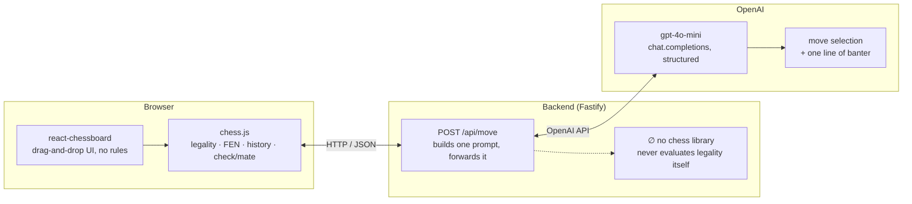
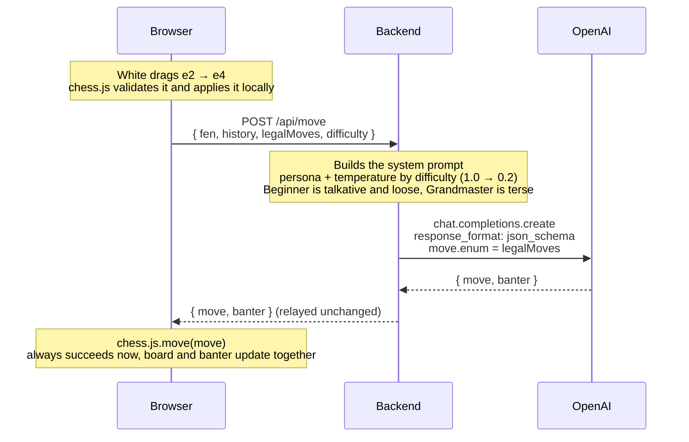
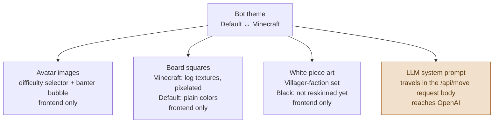

# Architecture

A human plays White in the browser. An OpenAI model plays Black. The backend's only job is to
carry a position to the model and a move back. It never runs a chess engine. These three diagrams
show where that rule actually lives, what happens on the wire for a single move, and how far a
cosmetic setting actually reaches.

## Where the rules live

`chess.js`, running in the browser, is the only piece of code in the whole system that knows what
a legal chess move is. The backend deliberately carries no chess library at all. It's a relay with
a prompt template, nothing more.

Everything left of the backend can veto a move. Everything right of it can't. That empty
`∅ no chess library` box is deliberate: it's what keeps the LLM fully responsible for move
generation, rather than a chess engine hiding server-side. Removing that constraint would mean
building a second, independent legality checker in the backend, and one more place for the two to
disagree.

## Anatomy of one move

What actually crosses the wire when White moves and Black replies, including the one change that
turned "the model can suggest anything" into "the model can only return a move that exists."

One HTTP round trip, one OpenAI call, per move. No polling, no retries once the enum landed.

**Why the enum, not free text.** This is the arrow that changed after a real bug: the model was
free-texting a move, occasionally an illegal one (it once returned `c3` when a White pawn already
stood on c3). Passing chess.js's own `legalMoves` list into OpenAI's structured-output schema as
an `enum` turned "please pick a legal move" from a request into a guarantee, without adding a
chess engine to the backend. The field literally cannot hold anything outside that list.

## One toggle, four places

A "Bot theme" switch (Default or Minecraft) sits next to the difficulty picker. It looks like a
skin swap, and three of the four things it touches are exactly that. The fourth reaches all the
way to OpenAI.

Easy to assume a "theme" is purely a skin. Three of these four boxes are. The fourth means picking
Minecraft actually changes what gets sent to `chat.completions.create`, not just what gets
rendered: the model roleplays the actual mob, so the Creeper's banter references exploding and the
Chicken's clucks nervously, instead of both sounding like the same generic chess opponent in a
costume. Difficulty is the other axis: theme and difficulty combine to pick both the avatar and
the exact prompt text.

---

Source: `apps/frontend/src/App.tsx`, `apps/backend/src/llm.ts`, `apps/backend/src/difficulty.ts`,
`apps/backend/src/index.ts`.
