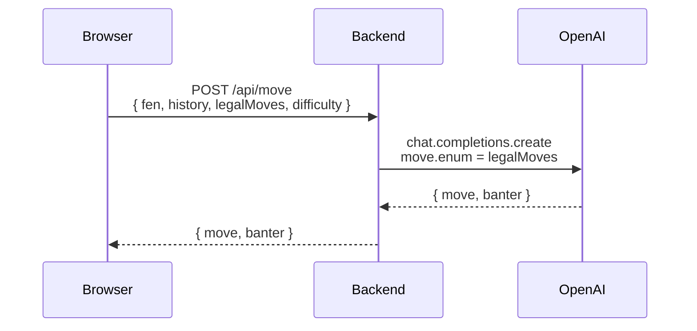

# LLM Chess

A human plays White against an OpenAI model playing Black. The model is fully responsible for
move generation. The backend never runs a chess engine of its own.
[chess.js](https://github.com/jhlywa/chess.js), running in the browser, is the only thing in the
system that knows what a legal move is.

Full spec in [PRD.md](./PRD.md).

## Stack

- pnpm workspaces monorepo: `apps/frontend`, `apps/backend`
- Backend: Fastify + TypeScript, `openai` npm package
- Frontend: Vite + React + TypeScript, Tailwind CSS, chess.js, react-chessboard
- Deployment: Docker, Kubernetes, Terraform (local `kind` cluster, see below)

## Setup

Requires Node 20+ and pnpm (`npm install -g pnpm` if you don't have it).

```bash
pnpm install
cp apps/backend/.env.example apps/backend/.env
```

Add your key to `apps/backend/.env`:

```
OPENAI_API_KEY=sk-...
```

Then, in two terminals:

```bash
pnpm dev:backend    # http://localhost:3000
pnpm dev:frontend   # http://localhost:5173
```

Open http://localhost:5173 and play.

## How it works

The frontend tracks the game with chess.js: it validates every White move, keeps the FEN and
move history, and detects check/checkmate/draws. After each White move it sends the current
position, move history, difficulty, and the full list of legal replies to `POST /api/move`.

The backend builds a system prompt from the chosen difficulty (Beginner through Grandmaster,
each with its own persona and sampling temperature) and calls OpenAI with a structured-output
schema. The `move` field is constrained to an `enum` of exactly the legal moves the frontend
sent over, so the response is guaranteed playable without the backend ever evaluating chess
rules itself. Each reply also includes a short line of in-character banter.



See [ARCHITECTURE.md](./ARCHITECTURE.md) for the full walkthrough: why the backend never runs a
chess engine, the real bug that led to the `enum` constraint, and how the Minecraft bot theme
reaches all the way into the LLM's prompt instead of staying a visual skin.

## Kubernetes / Terraform (local demo)

The whole app also runs on a real local Kubernetes cluster, provisioned entirely by Terraform: a
`kind` (Kubernetes-in-Docker) cluster, both apps built as Docker images and loaded into it, and
deployed as actual `Deployment`/`Service`/`Secret` resources. Not YAML manifests sitting unused in
the repo. No cloud account, no cost.

Requires Docker (running), [`kind`](https://kind.sigs.k8s.io/), and
[Terraform](https://developer.hashicorp.com/terraform):

```bash
brew install kind
brew tap hashicorp/tap && brew install hashicorp/tap/terraform
```

Then:

```bash
cp terraform/terraform.tfvars.example terraform/terraform.tfvars
# edit terraform.tfvars, add your real OPENAI_API_KEY

cd terraform
terraform init
terraform apply
```

Open http://localhost:5173 exactly like the dev setup: same ports, same app, now served by nginx
and Fastify running as pods in a real Kubernetes cluster instead of `pnpm dev`. Tear it all down
with `terraform destroy` when you're done; the full create-destroy-re-create cycle is tested and
clean.

See [ARCHITECTURE.md](./ARCHITECTURE.md) for the deploy topology diagram and the reasoning behind
the setup (why Terraform owns the cluster lifecycle, why images are loaded via `kind load` rather
than a registry, why there's no ingress controller).

## Out of scope

Per the PRD: move legality enforcement for the LLM, user accounts, persistence, multiplayer,
mobile layout, and per-move time limits.
