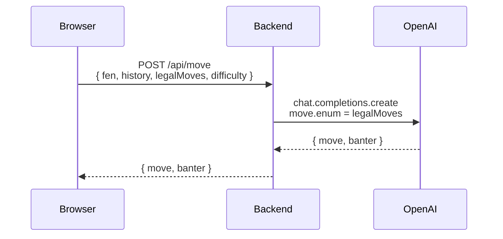

# LLM Chess

A human plays White against an OpenAI model playing Black. The model is fully responsible for
move generation. The backend never runs a chess engine of its own.
[chess.js](https://github.com/jhlywa/chess.js), running in the browser, is the only thing in the
system that knows what a legal move is.

Full spec in [PRD.md](./PRD.md).

## Stack

- pnpm workspaces monorepo: `apps/frontend`, `apps/backend`
- Backend: Fastify + TypeScript, `openai` npm package
- Frontend: Vite + React + TypeScript, Tailwind CSS, chess.js, react-chessboard
- Deployment: Docker, Kubernetes, Terraform (local `kind` cluster and real AWS EKS, see below)

## Setup

Requires Node 20+ and pnpm (`npm install -g pnpm` if you don't have it).

```bash
pnpm install
cp apps/backend/.env.example apps/backend/.env
```

Add your key to `apps/backend/.env`:

```
OPENAI_API_KEY=sk-...
```

Then, in two terminals:

```bash
pnpm dev:backend    # http://localhost:3000
pnpm dev:frontend   # http://localhost:5173
```

Open http://localhost:5173 and play.

## How it works

The frontend tracks the game with chess.js: it validates every White move, keeps the FEN and
move history, and detects check/checkmate/draws. After each White move it sends the current
position, move history, difficulty, and the full list of legal replies to `POST /api/move`.

The backend builds a system prompt from the chosen difficulty (Beginner through Grandmaster,
each with its own persona and sampling temperature) and calls OpenAI with a structured-output
schema. The `move` field is constrained to an `enum` of exactly the legal moves the frontend
sent over, so the response is guaranteed playable without the backend ever evaluating chess
rules itself. Each reply also includes a short line of in-character banter.



See [ARCHITECTURE.md](./ARCHITECTURE.md) for the full walkthrough: why the backend never runs a
chess engine, the real bug that led to the `enum` constraint, and how the Minecraft bot theme
reaches all the way into the LLM's prompt instead of staying a visual skin.

## Kubernetes / Terraform (local demo)

The whole app also runs on a real local Kubernetes cluster, provisioned entirely by Terraform: a
`kind` (Kubernetes-in-Docker) cluster, both apps built as Docker images and loaded into it, and
deployed as actual `Deployment`/`Service`/`Secret` resources that Terraform creates and manages,
rather than YAML files that just sit in the repo unused. It's all local, so there's no cloud
account or cost involved.

Requires Docker (running), [`kind`](https://kind.sigs.k8s.io/), and
[Terraform](https://developer.hashicorp.com/terraform):

```bash
brew install kind
brew tap hashicorp/tap && brew install hashicorp/tap/terraform
```

Then:

```bash
cp terraform/terraform.tfvars.example terraform/terraform.tfvars
# edit terraform.tfvars, add your real OPENAI_API_KEY

cd terraform
terraform init
terraform apply
```

Open http://localhost:5173 exactly like the dev setup: same ports, same app, now served by nginx
and Fastify running as pods in a real Kubernetes cluster instead of `pnpm dev`. Tear it all down
with `terraform destroy` when you're done; the full create-destroy-re-create cycle is tested and
clean.

**Making a code change after it's already running:** day-to-day development still happens through
`pnpm dev:backend`/`pnpm dev:frontend`, not this setup, since that's far faster feedback. If you
specifically want a change reflected in the running Kubernetes deployment:

```bash
cd terraform
terraform apply   # rebuilds and reloads whichever image's source actually changed
```

Both Deployments use a fixed image tag (`minechess-backend:local` / `minechess-frontend:local`)
rather than a per-build tag, so Kubernetes won't automatically notice the freshly-loaded image and
restart the pod on its own (from Terraform's point of view, the Deployment's declared image string
never changed, so `apply` reports no changes to it even though the image content underneath that
tag did change). One more command forces the pod to pick up the new image:

```bash
kubectl rollout restart deployment/backend -n minechess    # or deployment/frontend
```

A real deployment would tag images per build (a git SHA, a timestamp) instead of a static tag, so
this restart would happen automatically as part of `terraform apply`. Kept simple here since this
is a local demo, not production.

See [ARCHITECTURE.md](./ARCHITECTURE.md) for the deploy topology diagram and the reasoning behind
the setup (why Terraform owns the cluster lifecycle, why images are loaded via `kind load` rather
than a registry, why there's no ingress controller).

## Real AWS deployment (EKS)

The same app also runs on a real AWS EKS cluster, in a separate `terraform-aws/` Terraform root
independent from the local `kind` setup above. It reuses almost all the same Kubernetes resources,
just pointed at a real managed cluster instead of a local one, with images pushed to ECR instead of
loaded directly into a node.

This is real infrastructure with real cost and real provisioning time, not a quick local demo:

- Takes roughly 15-20 minutes for `terraform apply` to finish (EKS control plane and node group
  provisioning are slow by nature), so it can't be spun up live during a call.
- Costs money while running: the EKS control plane alone is $0.10/hour, plus EC2 node(s) and two
  load balancers on top of that. Apply it shortly before you need it, and `terraform destroy`
  right after; don't leave it running.
- `/api/move` has no authentication, matching the rest of the app. On a public AWS load balancer
  that means anyone who finds the URL could spend your OpenAI quota, so keep the exposure window
  short and consider a spend limit on the OpenAI dashboard as a safety net.

Requires the AWS CLI configured (`aws configure`) with credentials that can create IAM roles, VPCs,
and an EKS cluster (`PowerUserAccess` alone isn't enough, since it deliberately excludes IAM role
creation; `AdministratorAccess` works).

```bash
cp terraform-aws/terraform.tfvars.example terraform-aws/terraform.tfvars
# edit terraform.tfvars, add your real OPENAI_API_KEY

cd terraform-aws
terraform init
terraform apply
```

`terraform apply` prints `backend_url` and `frontend_url` at the end: real public load balancer
addresses. Open `frontend_url` in a browser and play, exactly like the local versions.

One improvement over the local demo: images here are tagged with a hash of each app's own source
code, not a static tag. That means a code change followed by `terraform apply` triggers a real,
automatic Kubernetes rolling update, no manual `kubectl rollout restart` needed the way the local
`kind` setup requires.

Images are cross-compiled for `linux/amd64` via `docker buildx`: EKS nodes are x86_64, the local Mac
builder is ARM64, so this is real cross-architecture emulation, not a formality. One side effect:
pnpm has to stay below version 10 here. Newer pnpm versions bundle a Rust-based install core, and
QEMU's user-mode emulation crashes that binary partway through `pnpm install` with a `tokio` I/O
panic. A native build never hits this, which is why the local `kind` demo was fine and this one
wasn't, until the Dockerfiles were pinned to `pnpm@9`.

```bash
terraform destroy
```

tears down the cluster, VPC, load balancers, and ECR repositories, stopping the billing.

## Out of scope

Per the PRD: move legality enforcement for the LLM, user accounts, persistence, multiplayer,
mobile layout, and per-move time limits.
